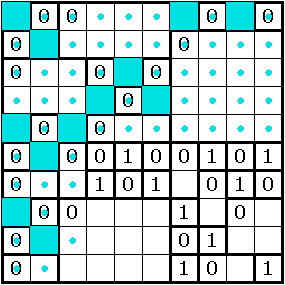
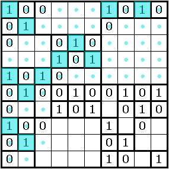
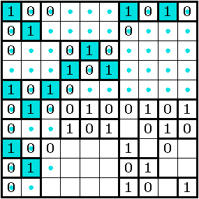

gridderface
===========

A Scala reboot of a keyboard interface for marking grid-based puzzles --- Nikoli-style, generally.

## What is Gridderface?

If:

- you want to solve a Sudoku or Slitherlink or Fillomino or Corral or Nurikabe or crossword or most any other puzzle with a square (or rectangular) grid in it
- you want to solve it on your computer (you don't have access to a printer or don't want to use one)
- the author hasn't put it into a puzzle applet, and you're too lazy to enter the numbers into one
- you like using the keyboard, vaguely vi-like keybindings, modal editing, and a steep learning curve
- ~~you have the fortitude to set up Scala and SBT on your machine~~

then this is the program for you!

You can also turn a grid-based Nikoli-style puzzle you wrote into a neat image to share with other people using Gridderface, without ever using the mouse! (I think...)

This is probably especially useful for puzzles where you have to draw lots of grid lines in irregular paths.

## Limitations

Gridderface is not a general image manipulation program. For example, you can't draw a line from an arbitrary grid point to another one, or flood-fill part of an image. I don't expect to add such features.

On the other hand, if you see any modular things that fit neatly in cells, (e.g. the crosses mathgrant uses in cells for [Shakashaka / "Proof of Quilt"](http://mathgrant.blogspot.tw/2010/12/rules-proof-of-quilt.html) puzzles), it's conceivable that they might be added someday.

Gridderface does not provide answer verification of any sort. This can and has been automated for many, many logic puzzle types (e.g. janko.at Puzzle Applets or PUZ-PRE v3), but Gridderface doesn't know how to read the clues or tell what type the puzzle is, and in any case there are countless puzzle types or variations and more are being invented all the time. (The author is particularly guilty of contributing to this.) You don't usually have automatic verification for a puzzle you solved on paper, either.

Gridderface cannot create or edit nonrectangular grids; however, you might still be able to hack it by making a grid with overlapping cells squeezed narrowly together, so, in particular, putting letters or numbers in hexagonal grid cells actually kind of works! (Is it possible that creating hexagonal grids might be added at some very distant point in the future?)

## Installation

1. Get [SBT](http://www.scala-sbt.org/).
2. Clone.
3. `cd` into the directory.
4. `sbt run`.
5. Cross your fingers.

**NEW**: Or, you can grab a release .jar file from above and hope it works!

## General Usage

The general way keys and commands work should be familiar to any Vim user, except that Gridderface doesn't yet support arbitrarily abbreviating commands.

## Solve a Puzzle

### Load the image

Issue the command `:read <filename>` to read an image from somewhere. Or drag an image or image file in. (In theory, dragging images should work, but the clipboard interface between Java and Mac OS X for images seems to be broken...)

### Setup the Grid

The command `:guess` will attempt to guess the location and size of the grid in the image. It is very naive as of the time of writing.

Manually adjusting the grid can be done in **grid-setting mode**, entered with the key <kbd>CTRL-G</kbd>. Then you can use these keys:

- <kbd>h</kbd><kbd>j</kbd><kbd>k</kbd><kbd>l</kbd> or arrow keys will change the grid position.
- <kbd>H</kbd><kbd>J</kbd><kbd>K</kbd><kbd>L</kbd> or shift-arrow keys will change one of the grid dimensions.
- <kbd>+-</kbd> will change both grid dimensions together.
- <kbd>[]{}</kbd> will change the number of rows or columns in the displayed grid.
- (experimental feature) <kbd>&lt;&gt;</kbd> will change the *excess*, making the cells smaller or larger than the grid lines that define them. You can use this to hack puzzles in hexagonal or irregular grids.

Typing a number will make all of these keys adjust the grid by (exponentially) larger increments; typing <kbd>\`</kbd> (backquote) followed by a number will make the adjustments change by (exponentially) smaller increments. The exponential increment is displayed in the status bar as `(M2^<number>)`.

To use the mouse, type `r` (for _resize_) and drag out the boundary of the grid you want. You'll have to first make the number of rows or columns correct. Alternatively, since the grid extends infinitely in all directions, you can skip that step and just drag out a rectangle the same size as a 10x10 square of puzzle cells, whether the puzzle's actual dimensions are bigger or smaller than 10x10.

Once you've set up the grid, it's often very distracting from the image and your own marks. You can hide it with `:hide grid`, or, to make it transparent, something like `:op grid 0.1` (`:op` is short for `:opacity`, which works too; `0.1` should be a number between 0 and 1.)

To get it back, you can `:op grid 0.5`. Or for full opacity `:show grid` works too.

### Solve

You can start solving now! Enter <kbd>CTRL-D</kbd> to enter **drawing mode** (this is the default mode). Move the cursor around with the obvious <kbd>h</kbd><kbd>j</kbd><kbd>k</kbd><kbd>l</kbd> or arrow keys.

There are lots of keys for entering particular figures on cells, edges, and intersections, including <kbd>f</kbd>, <kbd>.</kbd>, <kbd>Space</kbd>, and all ten digits; see below or the source code [StampSet.scala](https://github.com/betaveros/gridderface/blob/master/src/main/scala/gridderface/StampSet.scala) to see the list.

You can also enter arbitrary text into cells with one of several keys: `=`, `;`, `^`, or `_`. All four keys will enter the command line, where you can type some text and hit Enter. `=` enters big text. `;`, `^`, and `_` enter small text aligned in different places.

Also, `&` lets you enter Tapa-style clues, e.g. `&1 1 3` will put 1, 1, and 3 in the current cell.

There is also a `@` feature where after you type text and hit enter, it gets copied to the clipboard. This is useful for composing your answer key in a competition.

If you're solving a puzzle where you spend most or all of your time marking only cells (e.g. Sudoku, Nurikabe, crosswords), you can lock the cursor to only ever select cells with `:lock`. For intersections, it's `:ilock`. To unlock, `:unlock`.

To make drawing continuous lines easier, you can use uppercase <kbd>H</kbd><kbd>J</kbd><kbd>K</kbd><kbd>L</kbd> or shifted arrow keys. They can also be set to erase or draw other things, by typing `w` followed by another character (see below or [WriteSet.scala](https://github.com/betaveros/gridderface/blob/master/src/main/scala/gridderface/WriteSet.scala)).

To change the color of your marks, type `c` followed by a letter (see [PaintSet.scala](https://github.com/betaveros/gridderface/blob/master/src/main/scala/gridderface/PaintSet.scala)) or `%` followed by either a color name or a hex color in `#abcdef` format (with the hash!) For example, `cr` makes your color red, and `ck` makes it black.

## Create a Puzzle

You can initialize a blank image with standard dimensions (10x10), standard grid dimensions, and standard position with `:initgen`. The command can be followed by one or two numbers to specify the dimensions, e.g. `:initgen 13 37`.

For most puzzles, you now want to draw a grid into which the clues will do. These commands will create some of the presets:

- `:dec pre corral`
- `:dec pre fillomino`
- `:dec pre nurikabe`
- `:dec pre slitherlink`

(`dec` is short for `decorate`; `pre` is short for `preset`.)

You can choose exactly what grids you want and where you want them, which you may be able to figure out by looking at [GridderfaceDecorator.scala](https://github.com/betaveros/gridderface/blob/master/src/main/scala/gridderface/GridderfaceDecorator.scala), but these presets should be enough for 99% of uses.

After you're done, `:write filename.png` will output an image file.

## Detailed Drawing Mode

**Drawing mode** is entered by typing <kbd>CTRL-D</kbd>. It is indicated by the text "Draw" in the lower-left corner and a green cursor.

### Move the cursor

Should be intuitive: also <kbd>h</kbd><kbd>j</kbd><kbd>k</kbd><kbd>l</kbd> or arrow keys.

### Draw things

A lot of keys draw things on the grid. Here are some examples.

- <kbd>f</kbd> Fill, draw line
- <kbd>F</kbd> Slashed/shaded fill
- <kbd>0</kbd><kbd>1</kbd><kbd>2</kbd><kbd>3</kbd><kbd>4</kbd><kbd>5</kbd><kbd>6</kbd><kbd>7</kbd><kbd>8</kbd><kbd>9</kbd> Number
- <kbd>t</kbd> 10 or thick line
- <kbd>e</kbd> 11 or "transverse line" (for larger numbers, enter them with <kbd>=</kbd>)
- <kbd>o</kbd> Circle
- <kbd>O</kbd> Filled circle / bulb
- <kbd>x</kbd> Cross
- <kbd>.</kbd> Dot
- <kbd>,</kbd> Corner dot
- <kbd>v</kbd> Check
- <kbd>Space</kbd> Clear

The full list is in [StampSet.scala](https://github.com/betaveros/gridderface/blob/master/src/main/scala/gridderface/StampSet.scala), although the above keys are less likely to change.

### Write text

These keys change focus to the command line. The text will be drawn after you type it into the command line and press Enter.

- <kbd>=</kbd> default big text
- <kbd>;</kbd> small centered text
- <kbd>^</kbd> top-left text
- <kbd>_</kbd> bottom-left text
- <kbd>&</kbd> Tapa clues: arranges its space-separated arguments into the cell in a way depending on the number of arguments. Supports 1 to 4 arguments.
- <kbd>@</kbd> Answer key helper: This does _not_ draw the text on the grid after you press Enter, but rather copies it to the clipboard. This is intended to give you a place to fill out the extracted answer key for a competition puzzle.

## Draw continuous paths

When you want to draw a continuous border, it's exhausting to type something like <kbd>f</kbd><kbd>Left</kbd><kbd>Left</kbd><kbd>f</kbd><kbd>Left</kbd><kbd>Left</kbd><kbd>f</kbd><kbd>Left</kbd><kbd>Left</kbd>...

So instead you can use <kbd>H</kbd><kbd>J</kbd><kbd>K</kbd><kbd>L</kbd> or shifted arrow keys to do the same thing.

You can change the functionality of <kbd>H</kbd><kbd>J</kbd><kbd>K</kbd><kbd>L</kbd> by typing `w` followed by a character (mnemonic: `w` is for _write_). Valid keys include:

- `ww`: drawing solid lines (default)
- `wd`: dashed lines
- `we`: erase
- `wx`: crosses
- `w.`: dots

The complete list of all keystrokes is in [WriteSet.scala](https://github.com/betaveros/gridderface/blob/master/src/main/scala/gridderface/WriteSet.scala), although the ones listed above are less likely to change than the ones only listed in the code.

### Lock the cursor
These commands change which positions the cursor is allowed to be in. They are useful if you only intend on drawing on cells or on intersections with rare or homogeneous paths on the edges, especially in combination with the above keys for drawing continuous paths.

- `:unlock`: no restriction (default)
- `:lock`: cursor only selects cells; <kbd>h</kbd><kbd>j</kbd><kbd>k</kbd><kbd>l</kbd> or arrow keys jump to the next cell
- `:ilock`: cursor only selects intersections; <kbd>h</kbd><kbd>j</kbd><kbd>k</kbd><kbd>l</kbd> or arrow keys jumps to the next intersection

### Change the color

- <kbd>k</kbd> = black
- <kbd>r</kbd> = red
- <kbd>g</kbd> = green
- <kbd>b</kbd> = blue
- <kbd>c</kbd> = cyan
- <kbd>m</kbd> = magenta
- <kbd>y</kbd> = yellow
- <kbd>o</kbd> = orange
- <kbd>i</kbd> = indigo
- <kbd>l</kbd> = lemon
- <kbd>K</kbd> = light gray
- <kbd>R</kbd> = light red
- <kbd>G</kbd> = light green
- <kbd>B</kbd> = light blue
- <kbd>C</kbd> = light cyan
- <kbd>M</kbd> = light magenta
- <kbd>Y</kbd> = light yellow
- <kbd>w</kbd> = white

## Layers Manipulation

Sometimes, two dimensions aren't enough. For example, sometimes you want to draw a filled block and then write text on top of it. If you try doing this directly you'll find putting the text in a cell overwrites the block.

To let you do this, Gridderface has layers. In Draw mode, the `1/1` in the status indicates the current layer, where you're drawing, and how many layers there are total.

- `:newlayer` adds a new layer.
- <kbd>TAB</kbd> switches between different layers.
- `:rmlayer` removes the current layer.
- `:clear` clears the current layer of all marks.

This is useful in solving puzzles too: if you want to bifurcate in solving, you can create a new layer and draw on it; if it doesn't work out, it's easy to clear or delete just your marks on that layer.

By the way, <kbd>CTRL+Tab</kbd> lets you draw on the `undercontent`, which is its own group of layers that is underneath the decoration grid. This is useful if you want to shade certain cells of the grid without covering the grid lines.

## Buffers

You can change things about how they are drawn. In order from top to bottom, buffers are:

- `image`
- `undercontent`
- `decoration`
- `content` (stuff you've drawn)
- `grid`
- `cursor`

Here are commands.

- `:opacity` (or `:op`), as mentioned above, changes the opacity of layers
`:hide` and `:show` are short for calling `:opacity` with `0` or `1`.
- `:multiply` (or `:mul`) makes the layer drawn by multiplying each pixel value with the one below. Black multiplied by any color is black, but white multiplied by any color is that color. `:nomultiply` (or `:nomul`) undoes this. This often makes filling cells look nicer: for example, if the puzzle image is a black grid and you fill a cell with cyan, normally the cyan will block part of the black grid. It's even worse if the black cell had black text in it you still want to see.

  

  (The puzzle is [mathgrant's Evil Zinger 6](http://mathgrant.blogspot.tw/2009/05/evil-zinger-6-room-and-reason.html), CC-BY-NC 3.0. This also demonstrates how Gridderface is usable with puzzle images found in the wild. I hope I'm not spoiling anything.)

  You can somewhat work around this by changing your opacity, but that dilutes your color and it's still ugly when the gridlines are half-colored.

  

  So, if you `:multiply content`, then the black will show neatly through the cyan.

  

- `:antialias` (`:aa`; `:noantialias`, `:noaa`) changes the general antialias settings for the layer. `:textantialias` (`:taa`; `:notextantialias`, `:notaa`) does the same only for text.
