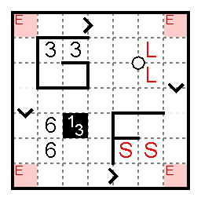

gridderface
===========

A Scala reboot of a keyboard interface for marking grid-based puzzles --- Nikoli-style, generally.

## What is Gridderface?

If:

- you want to solve a Sudoku or Slitherlink or Fillomino or Corral or Nurikabe or crossword or most any other puzzle with a square (or rectangular) grid in it
- you want to solve it on your computer (you don't have access to a printer or don't want to use one)
- the author hasn't put it into a puzzle applet, and you're too lazy to enter the numbers into one
- you like using the keyboard, vaguely vi-like keybindings, modal editing, and a steep learning curve
- ~~you have the fortitude to set up Scala and SBT on your machine~~

then this is the program for you!

You can also turn a grid-based Nikoli-style puzzle you wrote into a neat image to share with other people using Gridderface, without ever using the mouse! (I think...)

This is probably especially useful for puzzles where you have to draw lots of grid lines in irregular paths.

## Limitations

Gridderface is not a general image manipulation program. For example, you can't draw a line from an arbitrary grid point to another one, or flood-fill part of an image. I don't expect to add such features.

On the other hand, if you see any modular things that fit neatly in cells, (e.g. the crosses mathgrant uses in cells for [Shakashaka / "Proof of Quilt"](http://mathgrant.blogspot.tw/2010/12/rules-proof-of-quilt.html) puzzles), it's conceivable that they might be added someday.

Gridderface does not provide answer verification of any sort. This can and has been automated for many, many logic puzzle types (e.g. janko.at Puzzle Applets or PUZ-PRE v3), but Gridderface doesn't know how to read the clues or tell what type the puzzle is, and in any case there are countless puzzle types or variations and more are being invented all the time. You don't usually have automatic verification for a puzzle you solved on paper, either.

Gridderface cannot deal with puzzles in nonrectangular grids. Or anything else in nonrectangular grids, for that matter. (Is it possible that hexagonal grids might be added at some very distant point in the future? Maaaaybe?)

## Installation

1. Get [SBT](http://www.scala-sbt.org/).
2. Clone.
3. `cd` into the directory.
4. `sbt run`.
5. Cross your fingers.

**NEW**: Or, you can grab a release .jar file from above and hope it works!

## General Usage

The general way keys and commands work should be familiar to any Vim user, except that Gridderface doesn't yet support arbitrarily abbreviating commands.

## Solve a Puzzle

### Load the image

Issue the command `:read <filename>` to read an image from somewhere. Or drag an image or image file in. (In theory, dragging images should work, but the clipboard interface between Java and Mac OS X for images seems to be broken...)

### Setup the Grid

The command `:guess` will attempt to guess the location and size of the grid in the image. It is very naive as of the time of writing.

Manually adjusting the grid can be done in **grid-setting mode**, entered with the key `CTRL-G`. Then you can use these keys:

- `hjkl` or arrow keys will change the grid position.
- `HJKL` or shift--arrow keys will change one of the grid dimensions.
- `+-` will change both grid dimensions together.
- `[]{}` will change the number of rows or columns in the displayed grid.

Typing a number will make all of these keys adjust the grid by (exponentially) larger increments; typing `` ` `` (backquote) followed by a number will make the adjustments change by (exponentially) smaller increments. The exponential increment is displayed in the status bar as `(M2^<number>)`.

Once you've set up the grid, it's often very distracting from the image and your own marks. You can hide it with `:hide grid`, or, to make it transparent, something like `:op grid 0.1` (`:op` is short for `:opacity`, which works too; `0.1` should be a number between 0 and 1.)

To get it back, you can `:op grid 0.5`. Or for full opacity `:show grid` works too.

### Solve

You can start solving now! Enter `CTRL-D` to enter **drawing mode** (this is the default mode). Move the cursor around with the obvious `hjkl` or arrow keys.

There are lots of keys for entering particular figures on cells, edges, and intersections, including `f`, `.`, space, and all ten digits; see [StampSet.scala](https://github.com/betaveros/gridderface/blob/master/src/main/scala/gridderface/StampSet.scala) to see the list.

You can also enter arbitrary text into cells with one of several keys: `=`, `;`, `^`, or `_`. All four keys will enter the command line, where you can type some text and hit Enter. `=` enters big text. `;`, `^`, and `_` enter small text aligned in different places.

If you're solving a puzzle where you spend most or all of your time marking only cells (e.g. Sudoku, Nurikabe, crosswords), you can lock the cursor to only ever select cells with `:lock`. For intersections, it's `:ilock`. To unlock, `:unlock`.

To make drawing continuous lines easier, you can use `HJKL`. They can also be set to erase or draw other things, by typing `w` followed by another character (see [WriteSet.scala](https://github.com/betaveros/gridderface/blob/master/src/main/scala/gridderface/WriteSet.scala)).

To change the color of your marks, type `c` followed by a letter (see [PaintSet.scala](https://github.com/betaveros/gridderface/blob/master/src/main/scala/gridderface/PaintSet.scala)) or `%` followed by either a color name or a hex color in `#abcdef` format (with the hash!)

## Create a Puzzle

You can initialize a blank image with standard dimensions (10x10), standard grid dimensions, and standard position with `:initgen`. The command can be followed by one or two numbers to specify the dimensions.

For most puzzles, you now want to draw a grid into which the clues will do. These commands will create some of the presets:

- `:dec pre corral`
- `:dec pre fillomino`
- `:dec pre nurikabe`
- `:dec pre slitherlink`

You can choose exactly what grids you want and where you want them, which you may be able to figure out by looking at [GridderfaceDecorator.scala](https://github.com/betaveros/gridderface/blob/master/src/main/scala/gridderface/GridderfaceDecorator.scala), but these presets should be enough for 99% of uses.

After you're done, `:write filename.png` will output a file.

## Layer Visuals Manipulation

"Layers"

There are a couple commands for changing how "layers" are displayed.

Layers are:

- `image`
- `undercontent`
- `decoration`
- `content`
- `grid`
- `cursor`

- `:opacity` (or `:op`), as mentioned above, changes the opacity of layers
`:hide` and `:show` are short for calling `:opacity` with `0` or `1`.
- `:multiply` (or `:mul`) makes the layer drawn by multiplying each pixel value with the one below. Black multiplied by any color is black, but white multiplied by any color is that color. `:nomultiply` (or `:nomul`) undoes this.
- `:antialias` (`:aa`; `:noantialias`, `:noaa`) changes the general antialias settings for the layer. `:textantialias` (`:taa`; `:notextantialias`, `:notaa`) does the same only for text.
